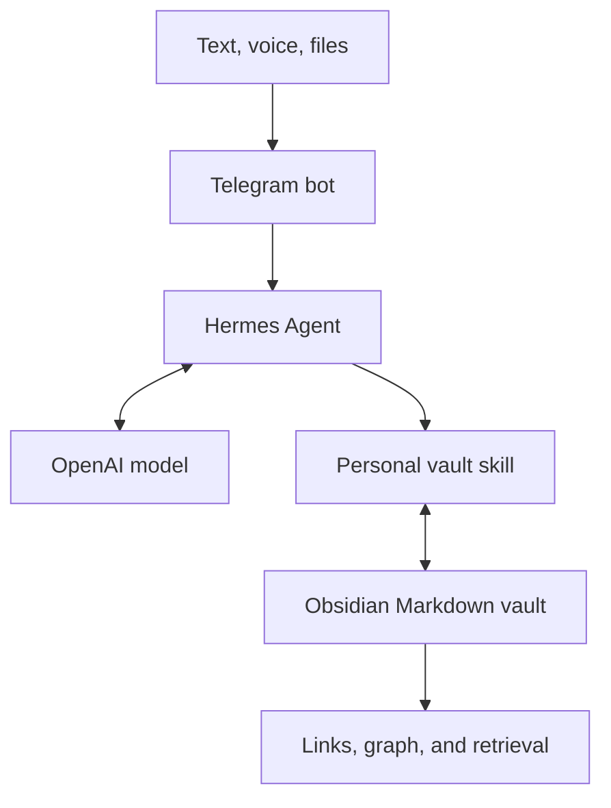

# Building a Second Brain I Can Talk To

> A local-first personal knowledge system built with Hermes Agent, OpenAI, Telegram, and Obsidian.

For years, I kept useful fragments in Apple Notes: observations, podcast takeaways, screenshots, book notes, product ideas, and things I wanted to remember about myself.

Capturing was easy. Finding the right thought at the right moment was not.

This project is my attempt to turn that archive into a second brain I can actually converse with. I can send it a text or voice note from Telegram, let Hermes organize it into a local Markdown vault, and later ask questions that help me zoom out:

- What am I repeatedly drawn toward?
- Which ideas have become genuine beliefs?
- Where do my goals and behavior contradict each other?
- What have I already learned that is relevant to the decision in front of me?

It is still a work in progress. I am building it around my daily life, not trying to design a perfect knowledge system upfront.

## Demo

[Watch the current second-brain demo](./assets/hermes-demo.mp4)

> Put the demo at `assets/hermes-demo.mp4`. If GitHub does not render the repository-hosted MP4 inline, drag the video into the GitHub README editor and replace the link above with the generated `github.com/user-attachments/...` URL.

## What the stack does

| Layer | Role |
|---|---|
| **Telegram** | The interface I already use on my phone for text, voice notes, files, and questions |
| **Hermes Agent** | The agent that retrieves notes, follows my filing rules, proposes edits, and writes approved changes |
| **OpenAI** | The model provider used for reasoning, classification, synthesis, and conversation |
| **Obsidian** | The local Markdown vault, visual graph, and place where I can inspect or edit everything myself |



The important part is that Obsidian—not the model—is the source of truth. The knowledge remains readable Markdown on my machine. Hermes is the interface and operator around it.

## How it helps me

### 1. Capture without breaking the moment

If I have a thought while walking, I send a voice memo to Telegram. Hermes can transcribe it, understand the context, and propose where it belongs.

### 2. Separate inputs from conclusions

I do not want a book quote and one of my own beliefs to look identical. My vault separates:

- what came from my experience;
- what came from the outside world;
- what I now think because of those inputs;
- what I am actively building or trying to become.

### 3. Retrieve ideas by meaning

Instead of remembering an exact filename, I can ask a natural-language question. Hermes searches the vault, synthesizes the relevant material, and cites the notes it used.

### 4. Zoom out

The most valuable use is not storage. It is perspective. I can ask the system to compare my manifesto, goals, projects, and recurring interests—then surface tensions I may be too close to notice.

### 5. Preserve control

Hermes shows me a proposed note, destination, or edit before it writes. Ambiguous material goes to the Inbox instead of being confidently misclassified.

## My vault structure

```text
AshKnowledgeVault/
├── 00 Inbox/
├── 01 Origins/
│   ├── From Within/
│   └── From the World/
├── 02 Thinking/
│   ├── Mental Models/
│   └── Ideas/
├── 03 Projects/
├── 04 Self/
│   ├── Manifesto/
│   ├── Goals/
│   └── Decisions/
├── 99 Archive/
├── Attachments/
├── Home.md
└── Knowledge Assistant Rules.md
```

The distinction that made this structure click for me is simple:

> **Origins** are where thoughts came from. **Thinking** is what I made from them.

| Location | What belongs there |
|---|---|
| `00 Inbox` | Captures that are unclear or not yet processed |
| `Origins/From Within` | Reflections, experiences, emotions, questions, and personal observations |
| `Origins/From the World` | Books, podcasts, articles, conversations, talks, and other external sources |
| `Thinking/Mental Models` | Durable principles and reusable ways of understanding the world |
| `Thinking/Ideas` | Hypotheses and possibilities that are still developing |
| `Projects` | Things I am actively building |
| `Self/Manifesto` | What matters to me and the person I want to become |
| `Self/Goals` | Current goals, habits, and progress |
| `Self/Decisions` | Important decisions and the reasoning behind them |
| `99 Archive` | Material I have explicitly marked inactive, retired, or superseded |

You do not need to copy this taxonomy. The useful structure is the smallest one that reflects distinctions you genuinely care about.

---

## Build your own

This walkthrough assumes macOS, Linux, or WSL2. Hermes also has a desktop installer for macOS and Windows; check the official quickstart for the newest options.

### 1. Install Obsidian and create a vault

Install [Obsidian](https://obsidian.md/) and create a new local vault. Note its absolute path.

For example:

```text
/Users/your-name/SecondBrain
```

Create a minimal structure first:

```text
00 Inbox/
01 Origins/From Within/
01 Origins/From the World/
02 Thinking/Mental Models/
02 Thinking/Ideas/
03 Projects/
04 Self/Manifesto/
04 Self/Goals/
04 Self/Decisions/
99 Archive/
Attachments/
```

Do not import your entire digital history yet. Start with a few real notes and learn what your system needs.

### 2. Install Hermes Agent

The current Hermes command-line installer for macOS, Linux, and WSL2 is:

```bash
curl -fsSL https://hermes-agent.nousresearch.com/install.sh | bash
```

Reload your shell if necessary:

```bash
source ~/.zshrc   # or source ~/.bashrc
```

Official guide: [Hermes Agent Quickstart](https://hermes-agent.nousresearch.com/docs/getting-started/quickstart)

### 3. Connect an OpenAI model

Run the interactive provider setup:

```bash
hermes model
```

Choose either:

- **OpenAI Codex** to authenticate with the supported ChatGPT/Codex subscription flow; or
- **OpenAI API (direct)** to use an OpenAI API key.

If you use direct API access, Hermes stores `OPENAI_API_KEY` in `~/.hermes/.env`. Do not put the key in your repository or Obsidian vault. A ChatGPT subscription and API billing are separate products, so check the option you are actually using.

Start a test conversation before adding anything else:

```bash
hermes
```

If Hermes cannot complete a normal chat, fix the model setup before continuing.

Provider reference: [Hermes LLM and model providers](https://hermes-agent.nousresearch.com/docs/integrations/providers)

### 4. Create a Telegram bot

1. Open [@BotFather](https://t.me/BotFather) in Telegram.
2. Send `/newbot`.
3. Choose a display name and a unique username ending in `bot`.
4. Save the bot token somewhere private.
5. Message [@userinfobot](https://t.me/userinfobot) to get your numeric Telegram user ID.

Configure Hermes:

```bash
hermes gateway setup
```

Select Telegram, then enter the bot token and your numeric user ID when prompted. The allowlist matters: your Telegram username is not the same as your numeric ID.

Start the messaging gateway:

```bash
hermes gateway
```

Now send your bot a message. Telegram supports text, voice memos, images, and file attachments through Hermes.

Official guide: [Hermes Telegram setup](https://hermes-agent.nousresearch.com/docs/user-guide/messaging/telegram)

> The gateway must be running for the bot to respond. For an always-available assistant, run it on an always-on machine or a properly secured server. Do not expose a tool-enabled agent publicly without understanding its permissions.

### 5. Write the vault rules

Create `Knowledge Assistant Rules.md` at the root of the vault. This is the constitution for the system.

Here is a sanitized starting point:

```markdown
# Knowledge Assistant Rules

## Source of truth

- This vault is the source of truth.
- Use only information the user has explicitly provided.
- Do not invent personal facts, beliefs, or classifications.
- Cite the source-note path when answering from the vault.

## Classification

- From Within: personal reflections, experiences, emotions, and observations.
- From the World: books, podcasts, articles, talks, conversations, and external learning.
- Mental Models: durable principles expressed in the user's own words.
- Ideas: hypotheses and possibilities still being developed.
- Projects: only things the user is actively building.
- Self: manifesto, goals, and important decisions.
- If the destination is unclear, use the Inbox.
- Never move material to Archive unless the user explicitly marks it inactive, retired, or superseded.

## Writing

- Search for related existing notes before proposing a new one.
- Preserve original links, dates, uncertainty, and the user's voice.
- Prefer one primary location and add meaningful wikilinks instead of duplicating content.
- Show the proposed path and complete edit before writing.
- Wait for explicit approval.
- After writing, verify the changed files and report exactly what changed.

## Safety

- Never store passwords, tokens, API keys, or other secrets in the vault.
- Do not modify `.obsidian`.
- Back up affected files before a large migration or rewrite.
```

The rules matter more than the folder names. Without them, an agent can organize quickly while quietly erasing distinctions you care about.

### 6. Give Hermes a personal vault skill

Hermes skills are instruction documents stored under `~/.hermes/skills/`. Create:

```text
~/.hermes/skills/personal-knowledge-vault/SKILL.md
```

Use this as a starting point, replacing the vault path:

```markdown
---
name: personal-knowledge-vault
description: Safely retrieve from and organize an Obsidian vault.
version: 0.1.0
---

# Personal Knowledge Vault

## When to Use

Use this skill for questions about the user's saved knowledge and for any
proposed change to the vault.

## Procedure

Vault root: `/ABSOLUTE/PATH/TO/YOUR/VAULT`
Rules file: `/ABSOLUTE/PATH/TO/YOUR/VAULT/Knowledge Assistant Rules.md`

## Always

1. Read the rules file before retrieving or proposing a write.
2. Search the existing vault before creating a note.
3. Treat Markdown files as the source of truth.
4. Distinguish quoted/source material from the user's own interpretation.
5. Cite the notes used in retrieval answers.

## For proposed writes

1. Choose exactly one primary destination.
2. If classification is genuinely unclear, use `00 Inbox`.
3. Preserve the user's wording, links, dates, and uncertainty.
4. Show the full proposed path and content.
5. Do not write until the user explicitly approves.
6. After approval, make only the approved change.
7. Verify the final file and report every changed path.

## Boundaries

- Never write secrets into the vault.
- Never modify `.obsidian`.
- Never classify new material directly into `99 Archive`.
- Do not rewrite historical beliefs as if the user always held the latest view.
```

Restart the Hermes conversation after changing the skill. In Telegram, `/new` starts a fresh session.

Official reference: [Hermes skills system](https://hermes-agent.nousresearch.com/docs/user-guide/features/skills)

### 7. Test retrieval before writing

Start with a question whose answer you can verify:

```text
What am I learning, thinking about, and trying to become?
Answer only from my vault and cite every source note.
```

A good result should:

- use the new vault paths;
- distinguish evidence from synthesis;
- cite the notes behind each claim;
- avoid inventing facts to make the answer sound complete.

### 8. Test the approval flow

Send a real or disposable reflection:

```text
I've been thinking about how learning technical skills changes what I
believe I am capable of. Where would you save this?
Propose the note, but do not write anything yet.
```

Hermes should propose a location and content, then wait. If it edits immediately, strengthen your rules before trusting it with larger imports.

### 9. Import old notes carefully

My Apple Notes were highly unstructured. The first instinct was to make one file per source, but that produced dozens of tiny notes and a visually noisy graph. What worked better for me was:

1. Group short source captures into a small number of meaningful thematic notes.
2. Keep substantial personal reflections separate under `From Within`.
3. Structure each thematic note around central ideas, key learnings, my synthesis, open questions, and sources.
4. Preserve every useful source link.
5. Move images into `Attachments/` and use descriptive filenames.
6. Review a complete migration plan before allowing any changes.
7. Create a backup before replacing or merging files.

Use a prompt like this:

```text
Inspect these imported notes and propose a migration plan for my vault.

Preserve every source link, meaningful observation, image, and unresolved
fragment. Group short related captures into thematic notes instead of making
one tiny note per link. Keep personal reflections separate from external
source notes. Do not modify the vault yet.

Show me:
- every file you would create;
- every existing file you would modify;
- every attachment you would add;
- duplicates or ambiguous material;
- the exact destination for each item.

Wait for explicit approval before writing, moving, replacing, or deleting
anything.
```

### 10. Add semantic links deliberately

Obsidian's graph displays explicit links. Storing related notes in nearby folders does **not** connect them.

After the notes are stable, ask Hermes to propose a small set of meaningful `[[wikilinks]]`. Avoid linking everything to everything. A useful link should explain a genuine relationship:

```markdown
## Related notes

- [[Sales, GTM, and Persuasion]] — the source material behind this mental model.
- [[Founder Reflections - Pivot and PMF Journey]] — where the principle was tested in practice.
```

I keep operational files, unresolved Inbox items, and raw mixed captures isolated until a real relationship is clear. A completely connected graph is not the goal; useful retrieval is.

## Prompts I use

### Capture a thought

```text
This is a personal reflection. Propose where it belongs, preserve my voice,
and show me the full note before writing anything.
```

### Retrieve with evidence

```text
What do I currently believe about selling?
Answer only from my vault. Cite every source note and clearly label any
inference as your synthesis.
```

### Zoom out

```text
Based only on my vault, what is the deepest tension between the person my
manifesto says I want to become and the patterns in what I am learning,
building, and worrying about?

Cite the evidence, separate observation from interpretation, and end with
one question I may be avoiding.
```

### Weekly review

```text
Review everything added to my vault this week. Find recurring themes,
possible connections, and anything that may be developing into an idea or
mental model. Do not modify anything.
```

## Safeguards I recommend

- **Allowlist your Telegram user ID.** Do not leave a tool-enabled bot open to strangers.
- **Keep secrets outside the vault.** Never commit `~/.hermes/.env`, bot tokens, or API keys.
- **Ask before writing.** Retrieval can be automatic; durable changes should be reviewable.
- **Back up before migrations.** Large imports and restructures should always be reversible.
- **Protect `.obsidian`.** Let Obsidian manage its own internal state.
- **Use a sandbox or constrained machine** if Hermes has terminal access.
- **Review model-generated synthesis.** A plausible interpretation is not automatically your belief.
- **Commit the vault privately** if you want version history, but check carefully for personal or sensitive material before using any remote repository.

## What surprised me

The technical setup was the easier part. The difficult questions were personal:

- What is worth remembering?
- What came from me, and what came from someone else?
- When does an interesting note become a belief?
- Which ideas are alive, and which are only things I once saved?
- How much structure improves retrieval before it becomes maintenance?

The graph was initially sparse because the notes had no explicit semantic links. Adding a few careful links made it useful. Adding links merely to make the graph look full would have made the underlying knowledge worse.

The system became valuable when it stopped being an archive and started becoming a mirror.

## Work in progress

This is the first usable version. I am still working on:

- making capture fit naturally into my daily schedule;
- improving voice-note processing;
- deciding when a recurring idea deserves its own mental-model note;
- keeping source notes concise without losing context;
- making weekly reviews useful rather than performative;
- testing safer always-on hosting;
- packaging the reusable rules and skill without publishing private notes.

If you build your own version, I would start with ten real notes and one question you genuinely want answered—not a complex folder system.

## Project status

Experimental and evolving. This repository documents my personal setup; it is not an official Hermes, OpenAI, Telegram, or Obsidian project.

## References

- [Hermes Agent](https://github.com/NousResearch/hermes-agent)
- [Hermes quickstart](https://hermes-agent.nousresearch.com/docs/getting-started/quickstart)
- [Hermes Telegram setup](https://hermes-agent.nousresearch.com/docs/user-guide/messaging/telegram)
- [Hermes model providers](https://hermes-agent.nousresearch.com/docs/integrations/providers)
- [Obsidian](https://obsidian.md/)
- [OpenAI platform](https://platform.openai.com/)
- [Telegram BotFather](https://t.me/BotFather)

## Acknowledgements

Built on [Hermes Agent](https://github.com/NousResearch/hermes-agent) by Nous Research, with an OpenAI model, Telegram as the conversational interface, and Obsidian as the local knowledge layer.
